## 1. Práctica Final: Clasificación con Scikit-learn y MLflow

* El codigo del entramiento del modelo se encuentra en el archivo

```py
modelo-clasificacion.ipynb
```

* imagenes de la interfaz de MLFlow del modelo entrenado

Imagen del experimento creado del modelo entrenado

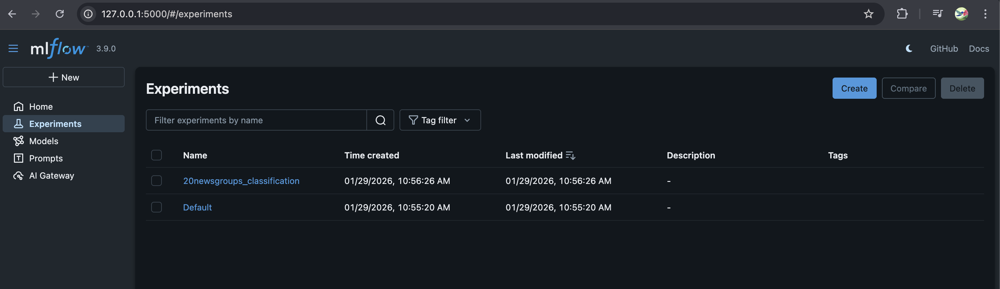

Imagen de los "runs" que ejecute del entrenamiento, en este caso solamente fueron 2

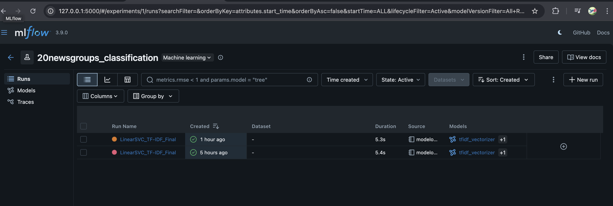

Imagen de los modelos guardados y usados para entrenar el modelo

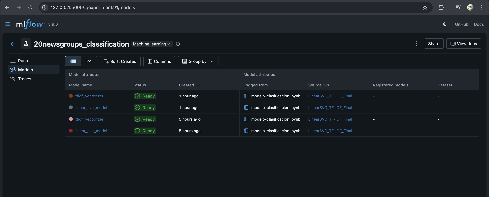

Imagen de los parametros y metricas del entrenamiento

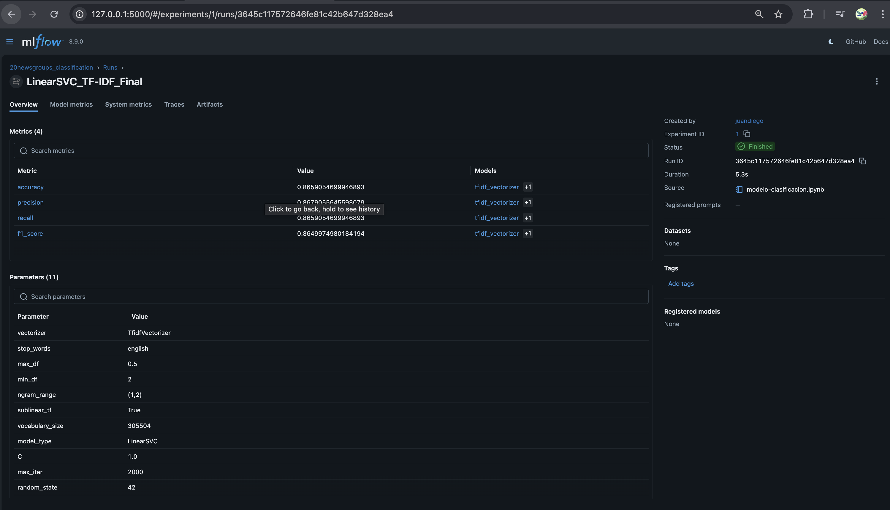

Imagen de la metricas en grafica del entrenamiento

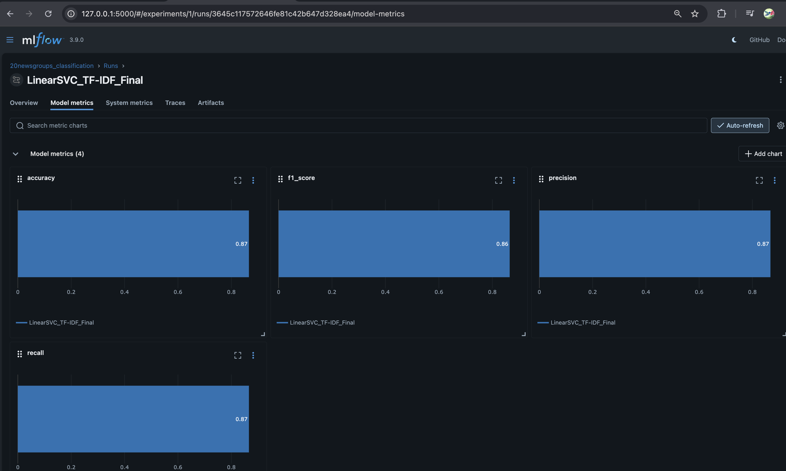

## 2. Generar .py de funciones y main con al menos dos argumentos de entrada

* La carpeta que contiene el codigo es

```py
    funciones_main_2_arg
```

## 3. Práctica parte FastAPI

* Captura de la pantalla docs con al menos 5 modulos.

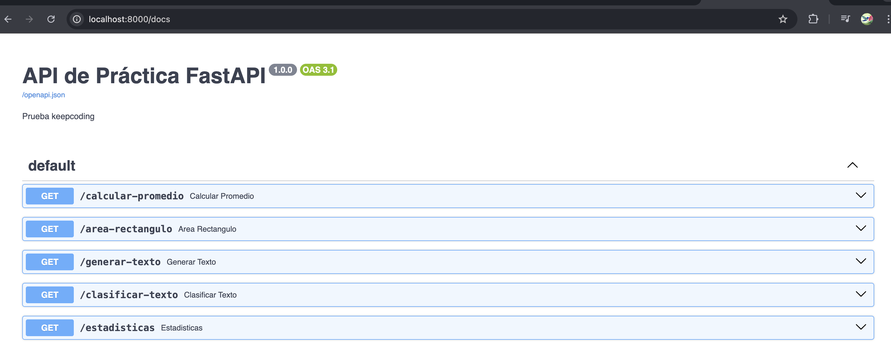

* Captura de cada una de los modulos con la respuesta dentro de docs.

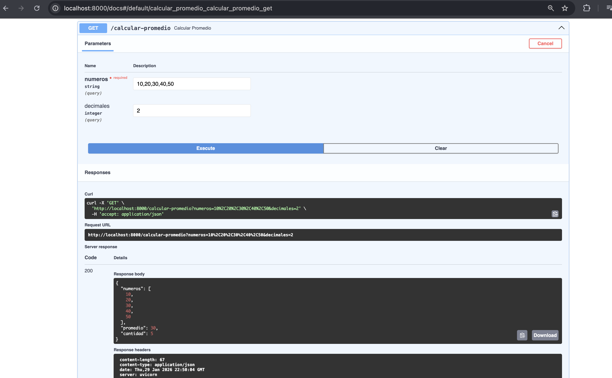
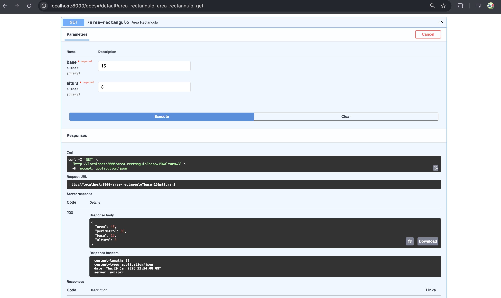
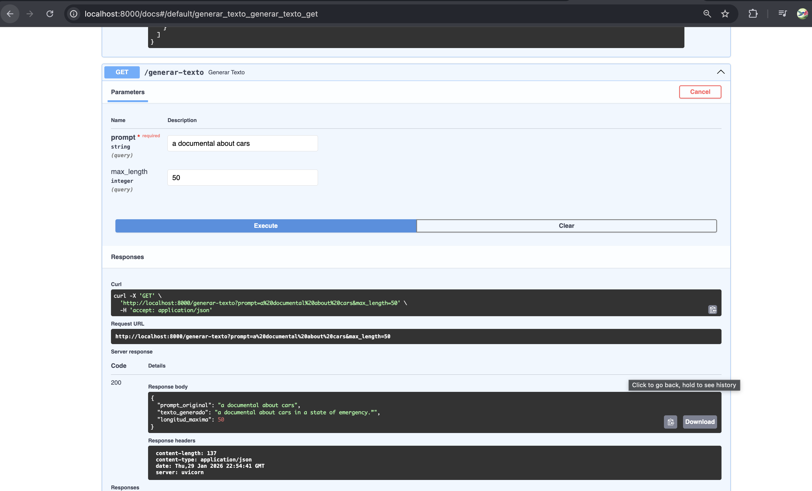
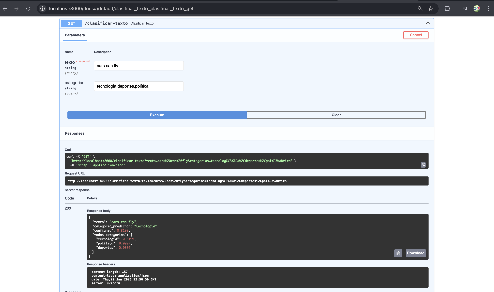
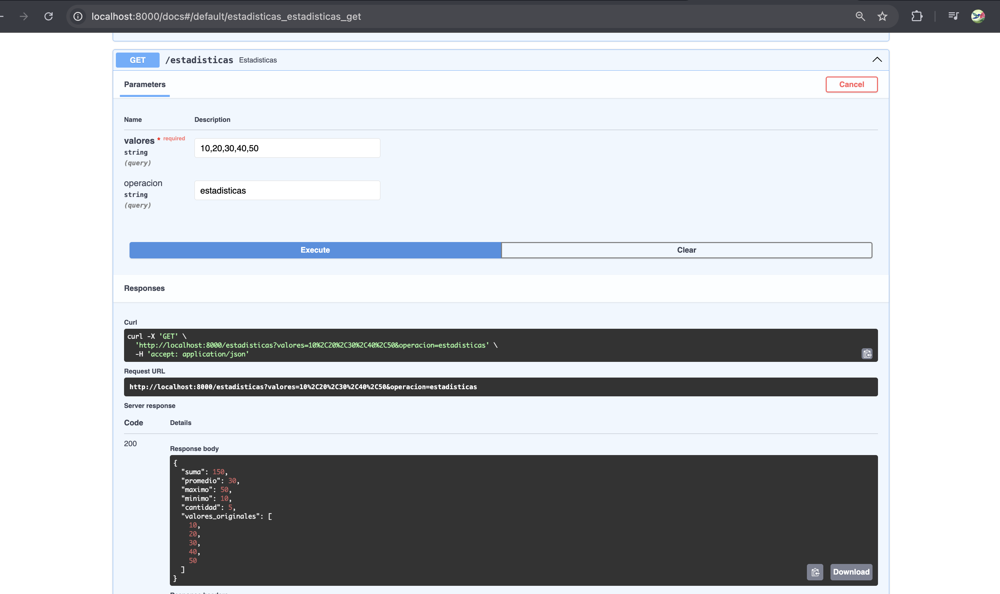

* Captura de cada uno de los modulos en la llamada https

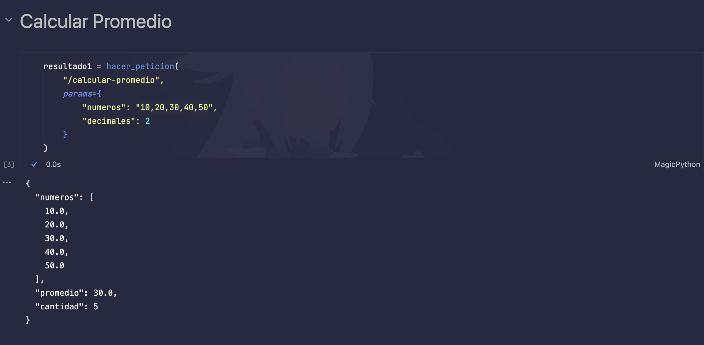
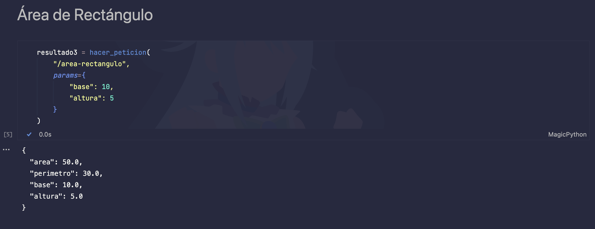
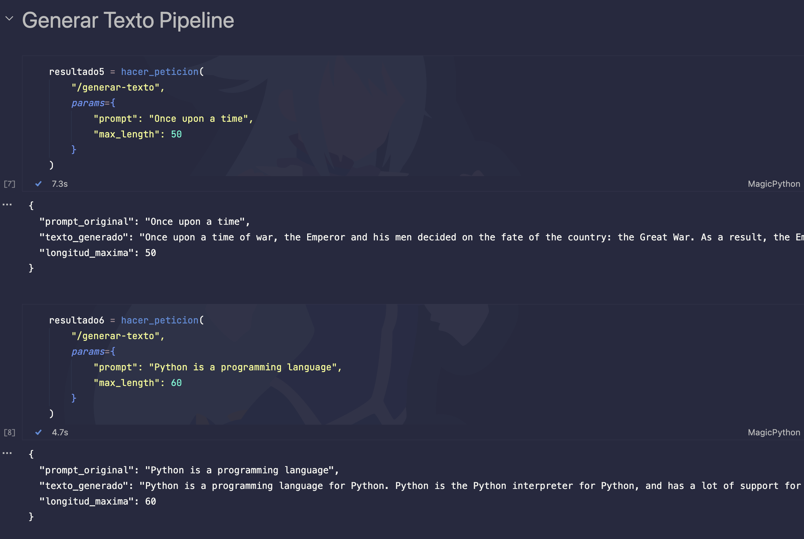
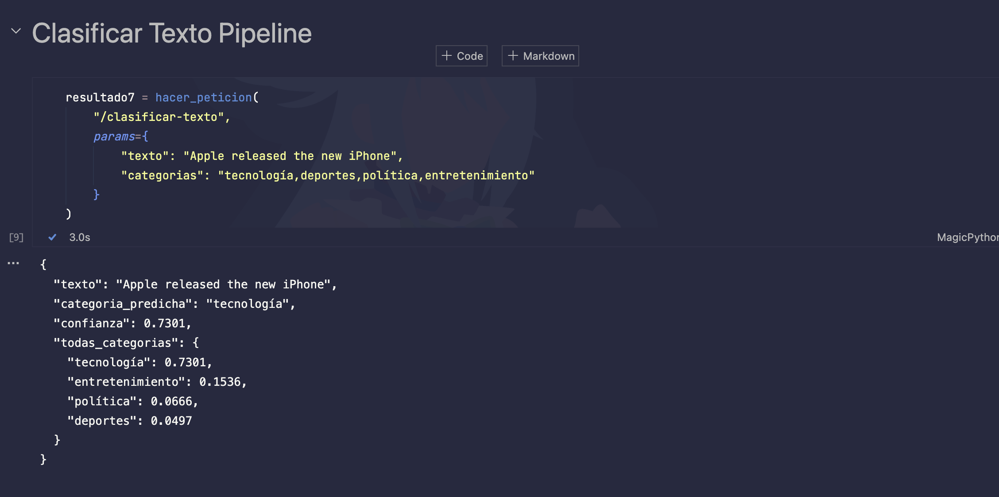
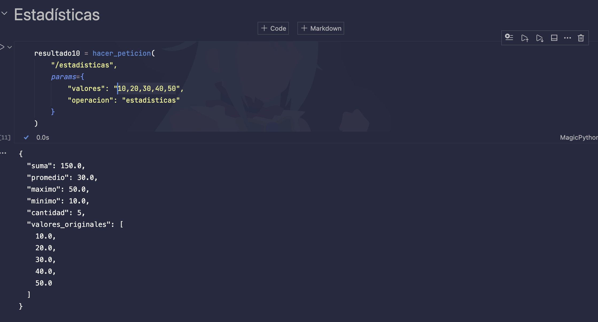

El codigo completo de las peticiones http se encuentra en el archivo

```py
    peticiones-http-fastapi.ipynb
```

* La carpeta que contiene el codigo de fastAPI es

```py
    fastapi
```

## 4. Despliegue del script en GCP Cloud Run

* Se encuentra en la carpeta deploy los archivos usados para el despliegue

```py
    deploy
```